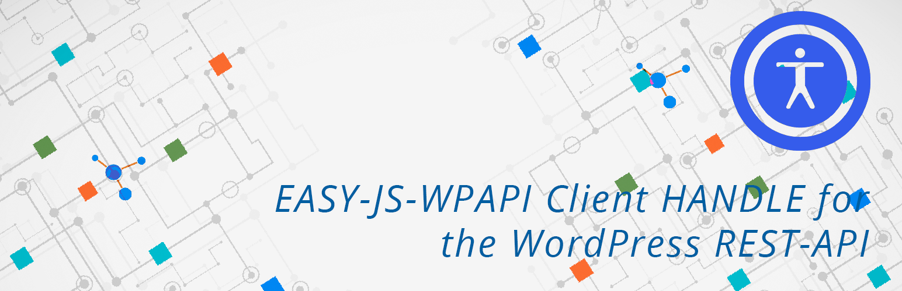
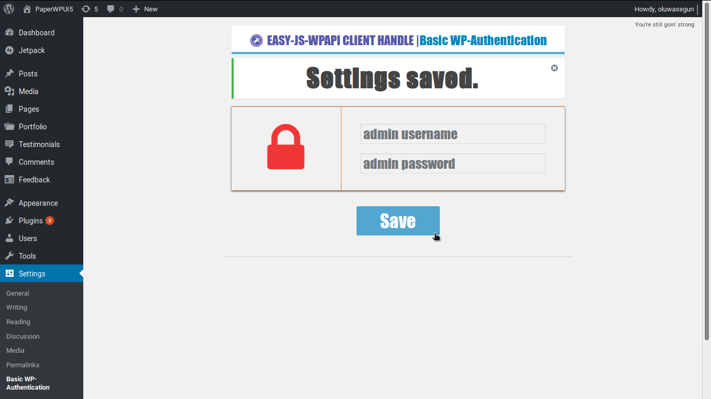
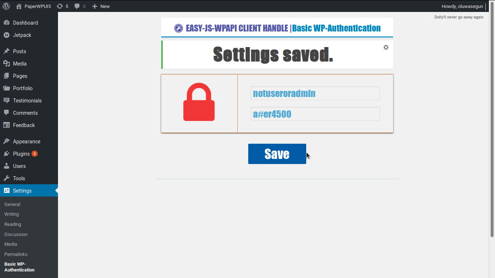
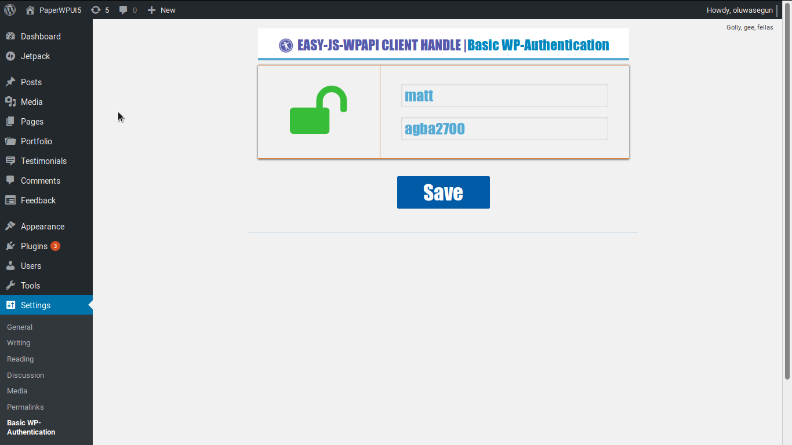
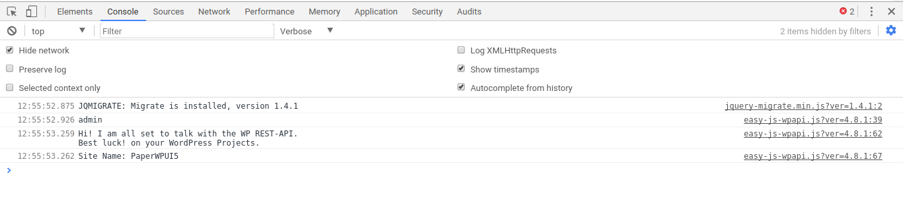
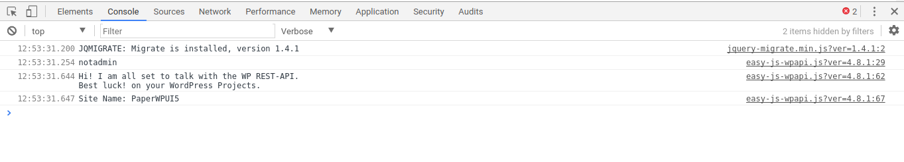
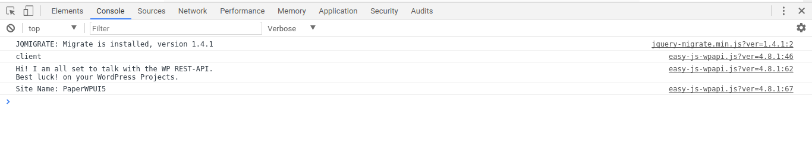

### EASY-JS-WPAPI Client HANDLE for the WordPress REST-API

**`E-mail`**: _`oasomefun@goldennigeria.com | oluwasegun.somefun@yahoo.co.uk`_

`License: GPLv2 or later`

## Description and Features

 _Easily talk with the WordPress REST-API to access and display your WordPress (model) data without 
 rest-authentication errors when creating Javascript Themes for consistent views by all users/clients accessing 
 your WordPress site._
 
* We chose the bundled node-wpapi isomorphic Javascript client, because it is the simplest way to get up and running
 quickly to display live website data in your installed WordPress website, using a Javascript-controlled Theme or Plugin

* The WEB Landscape is changing. Today, we can use Javascript to build Wordpress Themes. WordPress becomes our Model,
 which we can theme with Javascript using the WordPress REST-API.

* This plugin was developed to make life easy for web developers who which to create full-fledged
 Javascript WordPress Themes OR  Javascript-PHP WordPress Themes using a Javascript Framework/Library like:
 jQuery, React, OpenUI5, et.c. for use in a WordPress installation with the wpapi.js rest-client.

* It relies on the node-wpapi isomorphic javascript client to access the WP REST-API. The problem with accessing
 the REST-API using javascript-clients is the headache of authentication issues and private data access, which can
 hamper fluid display of the web-page when using Javascript to display the data.
 This plugin works under the hood and makes the javascript-client object, 'wp' that interfaces with the WP REST-API
 globally accessible for direct and easy use in a javascript(.js) file under the scope of a WordPress installation.

* It handles three authentication use cases: admin user, non-admin user and for a client from inside a WP installation.

* Say your WordPress website url = [ e.g: http://talker-test.com or http://localhost:8080/]
 WordPress switches to Cookie WP Authentication for  switched to when an administrator is currently logged in to
 the WordPress installation. Basic WP-Authentication is switched to when a Client accesses your WordPress website
 When an authenticated non-admin user, like an Author or Subscriber is currently logged in to your website,
 it displays data using Basic WP-Authentication.

* We then make the WPAPI global as a globally scoped javascript object, wp,
 for use in a WordPress Installation to talk with the WP REST-API on the go.

* So, with added ease, you can start building your next Javascript Themes for WordPress, or accessing the WP REST-API
 So start coding  and talking with the WordPress REST-API and display consistent, unhindered data,
 as you permit to all your clients, and users.

* See Demo WP Installation that shows how this plugin is used to display live website data from the WordPress REST-API
 In it we created a sample JS-controlled WordPress theme using jQuery and the 'wp' object provided by our bundled
 javascript client, which our plugin has made globally scoped and authenticated.

* For more info. and examples, you can check out the documentation
 of the node-wpapi javascript client at wp-api.org/node-wpapi

## Installation and Screenshots
1. Download or Copy the plugin into your WordPress installation's plugins directory on your Local development machine

2. Go to Plugins Dashboard. Activate the 'EASY-JS-WPAPI Client HANDLE for the WordPress REST-API'

   Now, Go to Users menu on the WordPress dashboard. Add new User. Create a dummy Administrator profile,
   complete with username, password and full name. e.g: username: 'matt', password: 'agba2700'

3. The Plugin is now activated, under it are the links: Settings | Deactivate | Edit
   Now, Click on this Settings link OR on the WordPress Dashboard, Click on the "Basic WP-Authentication"
   sub-menu of the Settings menu.

4. Enter the newly created dummy administrator username and its password. Click on the Save button
   This username and password will be checked by the plugin to determine if it is a valid user,
   and if it is a valid administrator user.
   If the details you enter is correct, it displays the green unlock icon.
   But if it is not, it displays the red lock icon, this tells you that you need to change
   it to a valid admin username and password.
   When the helper icon, displays a green unlock icon. You have finished setting up this plugin.
   
5. Go to your live production or development site. e.g: http://talker-test.org or http://localhost:8080

6. Check your browser console: If your administrator's name is Matt, then you should see a console output:
   "Hi! I am all set to talk with the WP REST-API.\n Best luck! on your WordPress Projects."

**STEP-4 Screenshots**

 

**STEP-6 Screenshots**

 

**N.B:**
* Mozilla Browser Console: Tools > Web Developer > Web Console
* Chrome Browser Console: More Tools > Developer Tools > Console

7. Open any .js script in your WordPress theme and start accessing the WP REST-API via the node-wpapi client

* Example: In a index.js controlling a index.php or index.html in a WordPress Theme
          
          wp.posts().embed().get().then(function( response ) {
                console.log( response );
                //do something with returned data/response
          });

_Beginner Theme Developers should remember that all .js scripts in a WordPress Theme
must be enqueued in the Theme's functions.php_
        
_See http://wp-api.org/node-wpapi/ for more info._

## Testing
**[Posts.xml](https://github.com/somefunAgba/xml_posts) | [Demo Theme](https://github.com/somefunAgba/demo_paperapp)**

* Click on the Demo Theme link: Download a sample zipped Javascript Theme and a .xml import file.

* Copy the theme to your Local WordPress Themes directory and Activate it.

* If your WP installation has no posts or a single post. Click on the Posts.xml link. 
Import the .xml posts file to your WordPress installation

* Go to your site-url homepage e.g: http://localhost:8080/

* You should see a demo Blog/News themed website.

## FAQs

* What is the WP REST-API?

**Check : https://developer.wordpress.org/rest-api/**

* Why should I use node-wpapi.js client?

**It is simple to use and understand.**

**Check : http://wp-api.org/node-wpapi/**

